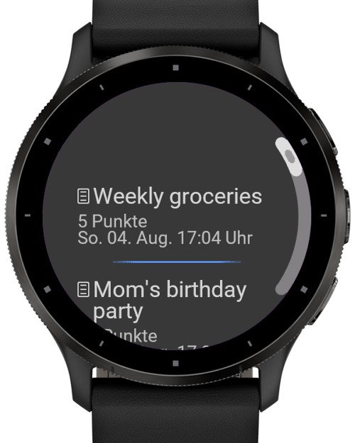
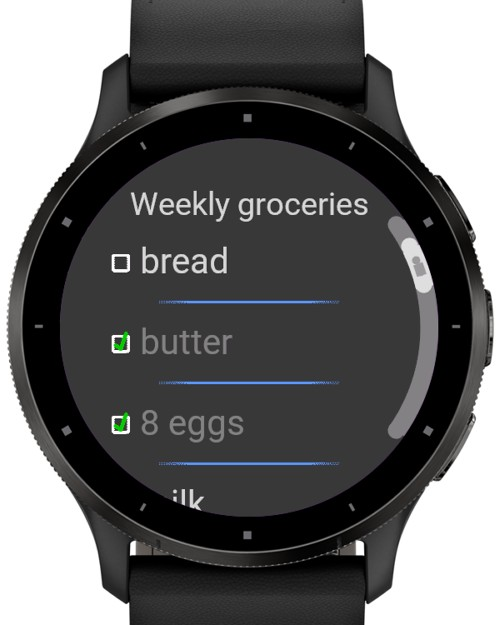
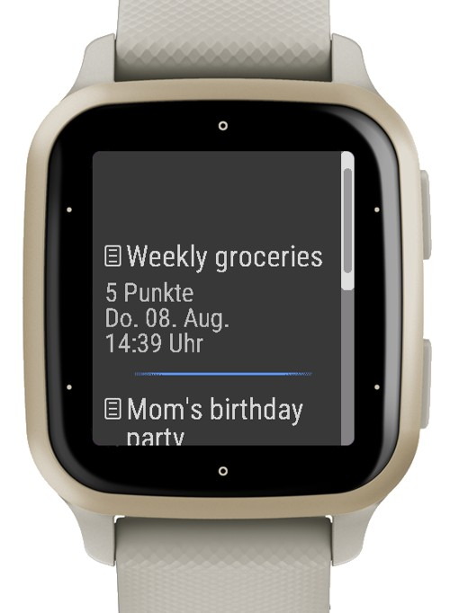
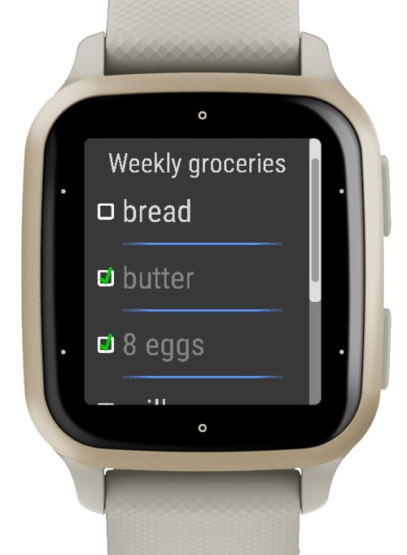

This is my app to display todo- or shopping-lists on your garmin watch. 
The lists are managed on your smartphone.  

The [companion app](https://github.com/RomanDrechsel/garmin-lists-ionic) is only available for [Android](https://play.google.com/store/apps/details?id=de.romandrechsel.lists).

### Assets
**Icons**:  
All icons are self-made.  

### Description
This garmin app contains 5 different themes and is available in english and german. 
Your garmin watch requires a touchscreen.  

You can manage your lists on your android smartphone with the [companion app](https://github.com/RomanDrechsel/garmin-lists-ionic).

### Screenshots

 

  
If you like the watchface, you can support me at  
[Paypal](https://paypal.me/RomanDrechsel) or [Buy me a coffee](https://www.buymeacoffee.com/romandrechsel)
